# The Little Red Riding Hood - Text Based Adventure Game

The Little Red Riding Hood game is a text based adventure game that follows the classic folktale story of Little Red Riding Hood.

## Beginning Scene
The opening page features the logo of the game, begin button and credit button that serves as the beginning screen that the user will see.
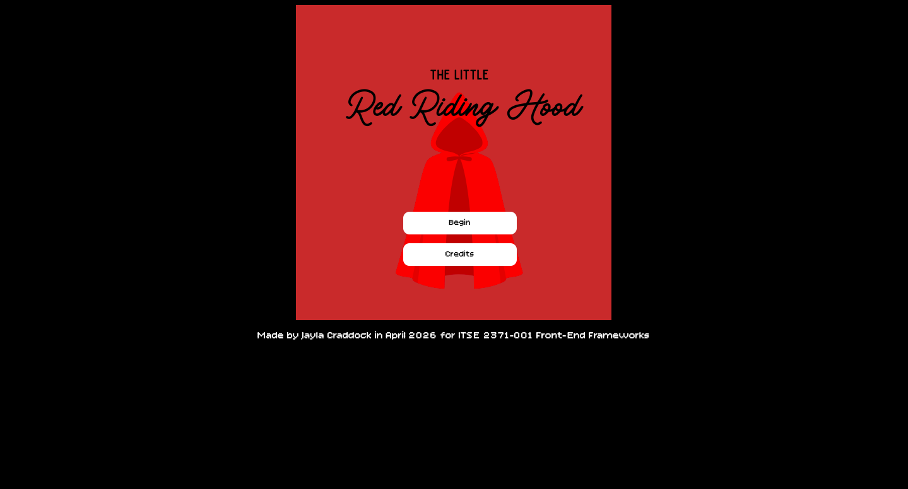

## First story scene
The story page follows after the user clicks on the begin button that follows the story of Little Red Riding Hood. In the story it has several different pictures and scenes to keep the user engaged throughout the story.
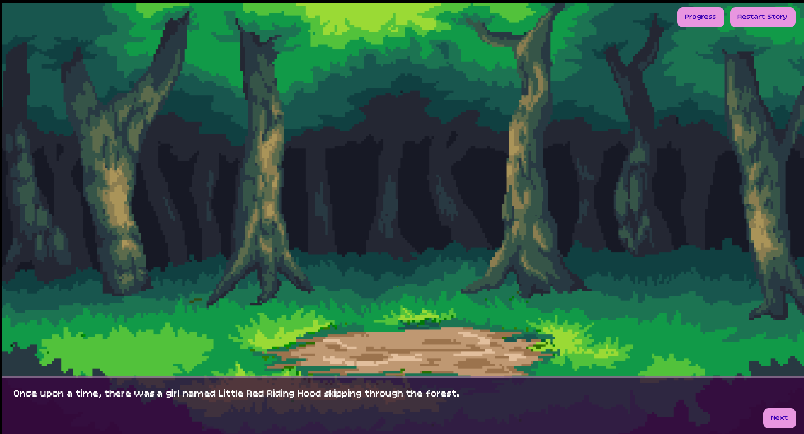

## Progress and Restart button
Throughout the entire story includes the progress and restart button that allows the user to check their progress in the story as well as start over from the very beginning of the story.
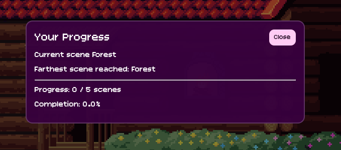

## Second story scene with choices
The second scene showcases the choices the user can choose from, the choices that the user makes determines the outcome of the story. 

## Third story scene
The third scene shows the outcome of picking the wrong choice in the story that leads to a game over screen that the user can click on the restart adventure button to start over from the beginning.
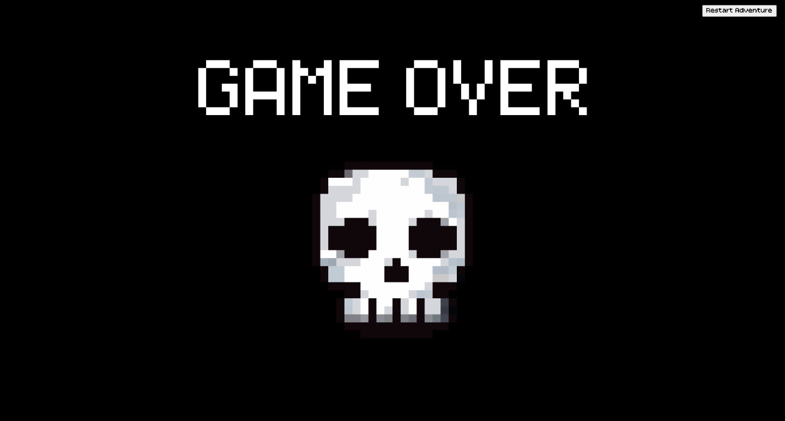

The rest of the scenes in the story include:

## Cabin:
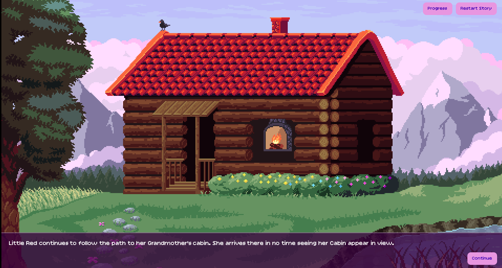

## Living Room:
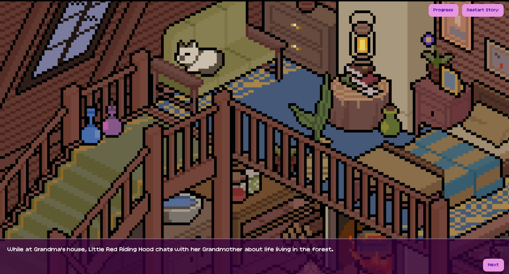

## Kitchen:
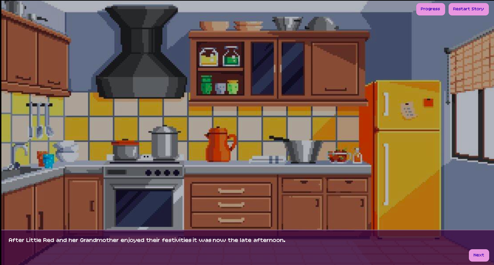

## Bedroom:
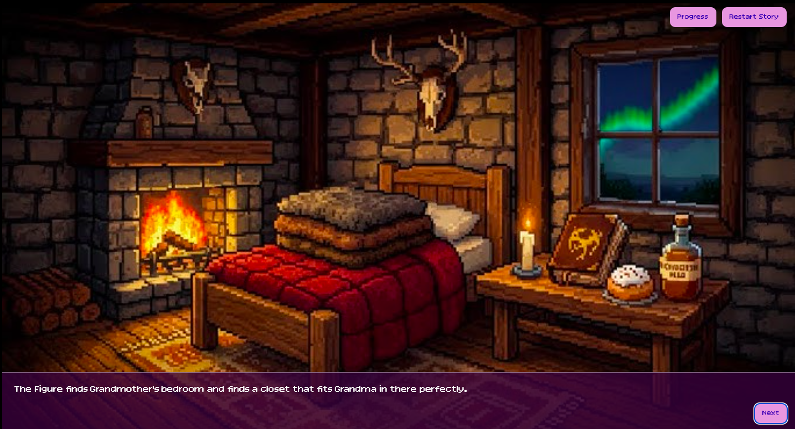

## Bathroom:
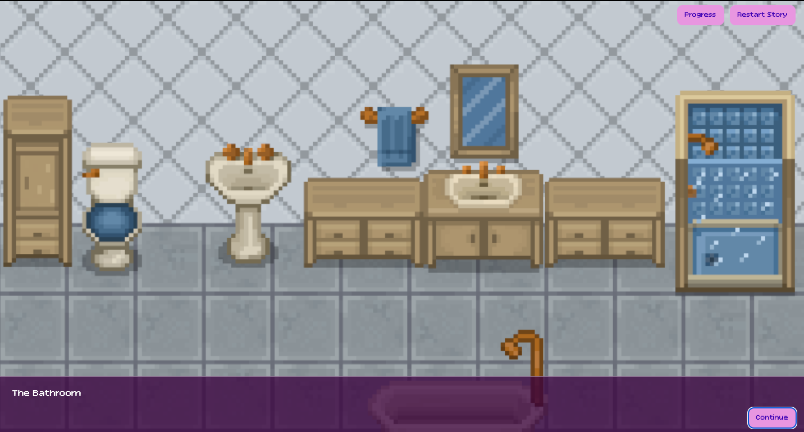

## Creepy forest: IMPORTANT NOTE: When getting to the second to last scene of the game there is a loud sound that plays during the standoff with the huntsman and the wolf. You can turn it off by muting your device.
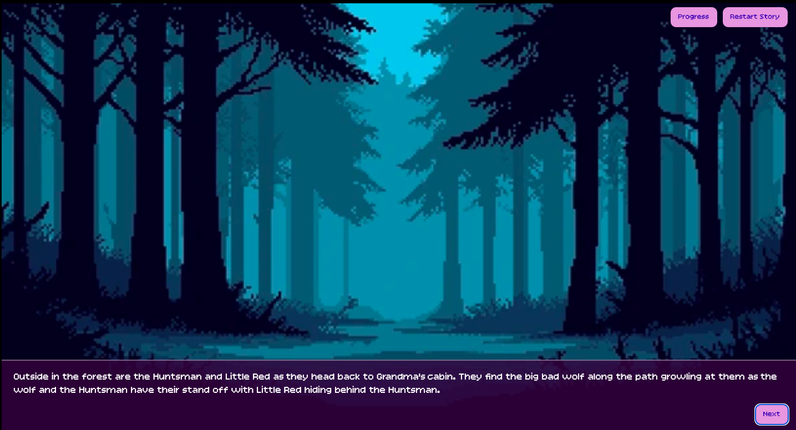

## Gun that uses the guntshot sound effect. You can turn it off by muting your device.
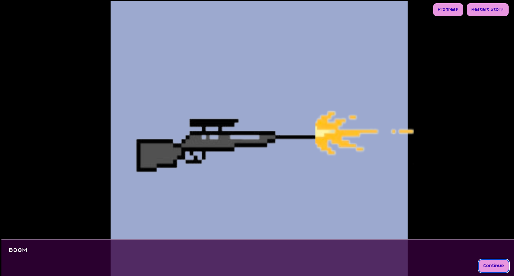

## Huntsman’s Cabin:

## Huntsman's Living room:
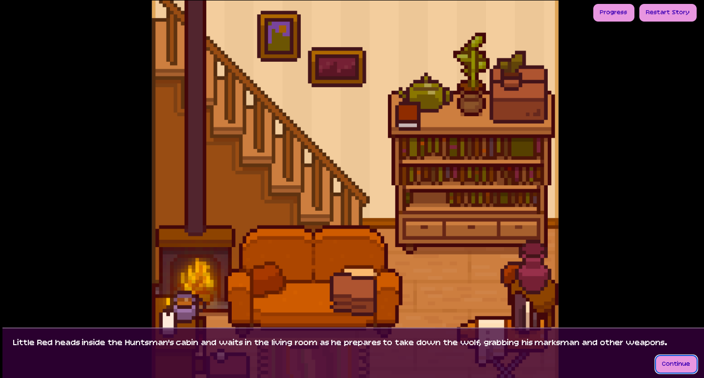

## Another Creepy Forest:
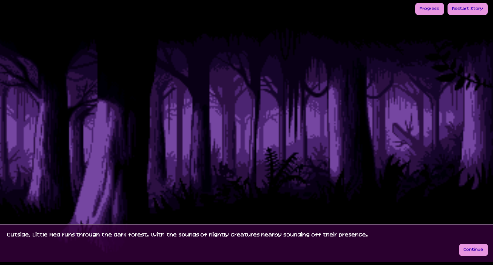

## Credit list:
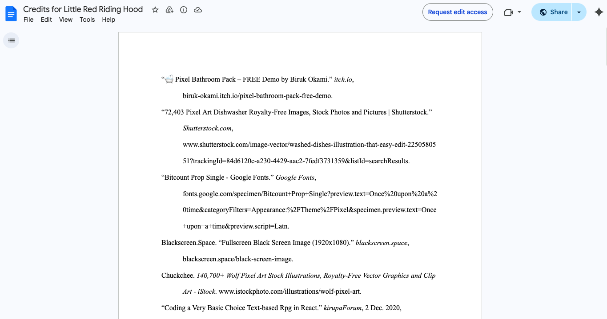

